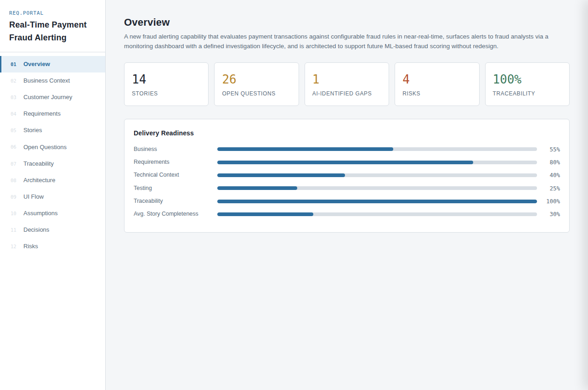
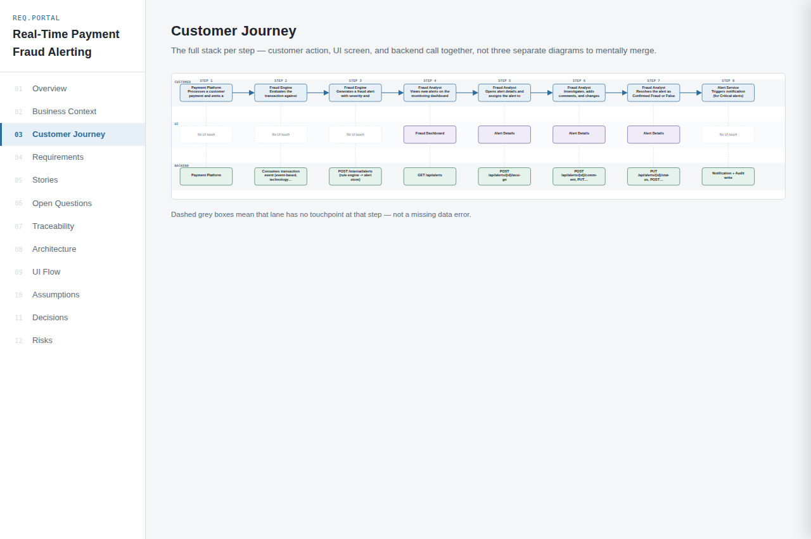
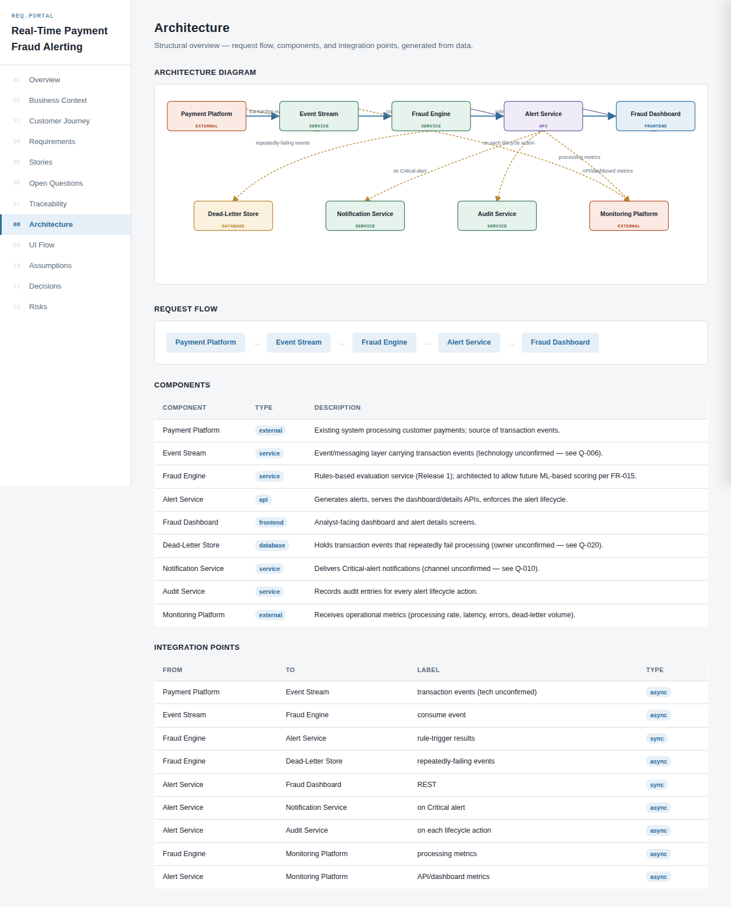
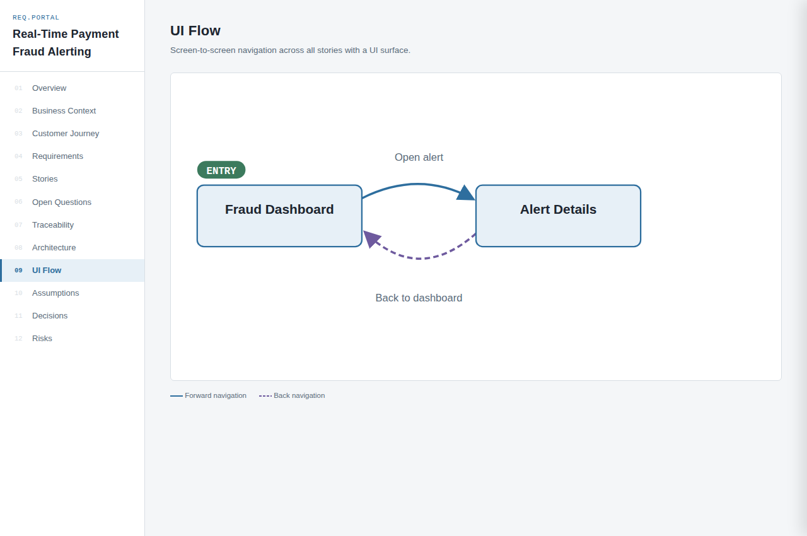
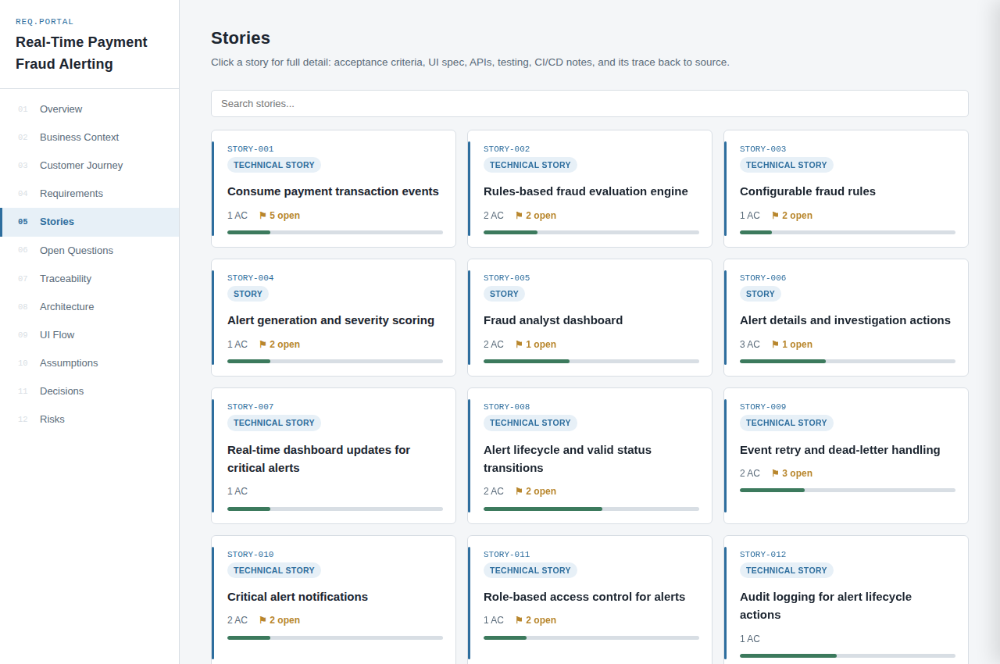
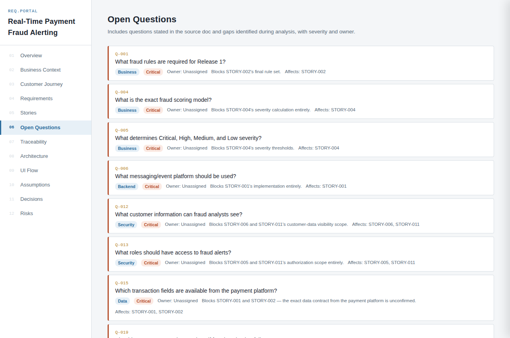

# jira-ticket-builder-skill

Turns rough input into structured Jira work — either a single ticket, or a full requirements
document decomposed into linked stories with an explorable HTML portal (business flow,
architecture, UI flow, and customer-journey diagrams, all generated from data).

Works as a **Claude Skill** (triggers automatically in Claude.ai, Claude Code, or Cowork) and as
**portable instructions** for any other LLM tool with code execution (ChatGPT Custom GPTs,
ChatGPT Advanced Data Analysis, etc.) — see [Model support](#model-support) below.

## What it does

**Single-ticket mode** — paste a bug report, a one-line feature ask, or meeting notes, and get
back one fully-structured Jira ticket. Supports a quick mode (short, lightweight) and a full
enterprise mode (business context, technical detail, testing strategy, rollout/rollback), adapted
by issue type (Bug, Story, Task, Spike, Tech Debt, Security, Incident).

**Decomposition mode** — hand it a rough requirements document (a product brief, meeting notes, a
spec with open questions scattered through it) and get back:

- Multiple independently-shippable Jira stories, each traced back to its source requirement,
  plus a CSV that imports them straight into Jira (with an epic and dependency links)
- An open-questions map (including gaps the model identifies but you didn't ask, clearly marked)
- A traceability matrix and a delivery-readiness score
- Risks and decisions logs (only populated when something real is there — no filler)
- An HTML portal (one self-contained file, or 12 linked pages): Overview, Business Context (+ flow diagram), Customer Journey (swimlane:
  customer action → UI screen → backend call), Requirements, Stories, Open Questions,
  Traceability, Architecture (+ diagram), UI Flow (+ diagram), Assumptions, Decisions, Risks

## Example output

Generated end-to-end from a rough requirements doc — no manual editing, no cherry-picking, this
is what a full run produces.

**Overview** — stats and delivery-readiness at a glance:



**Customer Journey** — customer action, UI screen, and backend call together per step:



**Architecture** — components and integration points, generated from data, not hand-drawn:



**UI Flow** — screen-to-screen navigation with forward/back edges distinguished:



**Stories** — each card links to a full detail drawer (AC, APIs, testing, dependencies):



**Open Questions** — severity-sorted, with AI-identified gaps clearly flagged separate from
questions the source document actually asked:



## Installation

### Claude Skill

```bash
npx jira-ticket-builder-skill
```

This installs the skill into `.claude/skills/jira-ticket-builder-skill/` in your current
directory. Claude Code and Cowork pick up skills from that location automatically. For Claude.ai,
upload the `skill/` folder's contents (or the packaged `.skill` file, if you have one) via the
skill-creation flow.

### Portable prompt (ChatGPT / other LLMs)

```
npx jira-ticket-builder-skill --prompt
```

This additionally installs `jira-ticket-builder-prompt/INSTRUCTIONS.md` in your current
directory (deliberately outside `.claude/skills/`, which Claude scans for skills). See
[Model support](#model-support) for how to use it.

### Installer options

| Option | Effect |
| --- | --- |
| `--target <dir>` | Install the skill somewhere other than `.claude/skills/jira-ticket-builder-skill` |
| `--prompt` | Also install the portable prompt |
| `--prompt-target <dir>` | Install the portable prompt somewhere other than `./jira-ticket-builder-prompt` |
| `--force` | Replace an existing install (stale files from older versions are removed) |
| `--dry-run` | List what would be installed without writing anything |
| `--version`, `--help` | Print version / usage |

To upgrade an existing install: `npx jira-ticket-builder-skill@latest --force`.

### Manual install

Clone or download this repo; the `skill/` folder is a complete, self-contained Claude Skill
(`SKILL.md` + `assets/` + `references/`).

## Model support

| Environment | How to use it |
|---|---|
| Claude.ai / Claude Code / Cowork | Native skill — triggers automatically once installed |
| ChatGPT (Custom GPT) | Paste `prompt/INSTRUCTIONS.md` into the GPT's Instructions field; upload `skill/assets/` and `skill/references/` as Knowledge files so Code Interpreter can read them |
| Any other LLM with code execution | Use `prompt/INSTRUCTIONS.md` as a system prompt; give the model filesystem access to `skill/assets/` and `skill/references/` |
| A plain chat model with no code execution | Single-ticket mode still works (it's just filling in a markdown template). Decomposition mode's portal-generation step needs to run a Python script, so it requires code execution somewhere in the loop |

The underlying logic — the JSON schema, the markdown templates, and the Python portal-builder
script — is plain data and code with no model-specific API calls, so it behaves identically
regardless of which model is driving it. Only the *triggering* mechanism (Claude's skill system
vs. a pasted system prompt) differs per platform.

## Repository structure

```
jira-ticket-builder-skill/
├── skill/                       # Claude Skill (SKILL.md + assets + references)
│   ├── SKILL.md
│   ├── assets/
│   │   ├── full-template.md          # Full enterprise ticket template
│   │   ├── quick-template.md         # Quick-mode ticket template
│   │   ├── story-template.md         # Dedicated Story template
│   │   ├── portal-page-template.html # Shared multi-page portal template (with diagrams)
│   │   ├── build_portal.py           # Generates the portal (single file or 12 pages) from decomposition JSON
│   │   ├── quality_gate.py           # Validates decomposition JSON; computes readiness metrics
│   │   ├── decomposition.schema.json # Machine-readable schema the gate validates against
│   │   └── export_jira.py            # Jira CSV import file + Markdown stories
│   └── references/
│       ├── section-guide.md          # Which full-template sections apply per issue type
│       └── decomposition-schema.md   # JSON schema for decomposition mode
├── prompt/
│   └── INSTRUCTIONS.md          # Portable version of SKILL.md for non-Claude LLMs
├── bin/
│   └── install.js               # npx installer
├── tests/                       # Python + Node test suites (not shipped to npm)
├── docs/
│   └── screenshots/             # README screenshots (not shipped to npm)
├── .github/workflows/ci.yml     # Runs the tests on every push / PR
├── CHANGELOG.md
├── package.json
├── LICENSE
└── README.md
```

## Running the scripts by hand

Everything the skill does after writing the decomposition JSON is plain Python 3 with no
dependencies, so you can run it yourself or in CI.

**Check the data** — validates against `decomposition.schema.json` and runs 16 consistency checks
(unique IDs, every reference resolves, traceability agrees with the stories, no circular
dependencies, …). Exits non-zero on failure.

```
python3 skill/assets/quality_gate.py data.json            # --json for a machine-readable report
```

**Build the portal**

```
python3 skill/assets/build_portal.py skill/assets/portal-page-template.html data.json portal/ --check --single-file
```

| Option | Effect |
| --- | --- |
| `--single-file` | One self-contained `index.html` with all 12 views (switch views via `#stories`, `#risks`, …). Nothing to unzip. |
| `--check` | Run the quality gate first; nothing is written if it fails |
| `--zip PATH` | Package the output into a single archive |
| `--inline` | Multi-page mode only: embed the data in every page instead of a shared `portal-data.js` |
| `--model-metrics` | Keep the readiness / completeness numbers written in the data instead of recomputing them |

Readiness percentages, per-story completeness (with a list of what's missing) and traceability
coverage are calculated from the data rather than taken from the model's estimates — see
`skill/references/decomposition-schema.md` for the formulas. All values are escaped before they
reach the page, so text pasted from requirements documents can't break the portal.

Without `--single-file` you get 12 linked pages plus `portal-data.js`; a 1,000-story portal is
1.7 MB instead of the 14 MB it was when every page embedded the data. Keep those files together
in one folder — the pages load the data and link to each other by relative path.

**Export to Jira**

```
python3 skill/assets/export_jira.py data.json --csv jira-import.csv --md stories.md
```

The CSV imports through Jira's CSV importer: one Epic plus a row per story, descriptions in Jira
markup (user story, acceptance criteria, scope, UI, APIs, testing, open questions, source
requirements), labels, the epic as Parent, and "blocks" / "relates" links between stories. When
importing, map Issue Id → Issue Id, Parent → Parent, Link "blocks" → Blocks, Link "relates" →
Relates, and the rest to the field of the same name.

| Option | Effect |
| --- | --- |
| `--type-map A=B` | Map a story type to a Jira issue type (defaults: Spike/Task → Task, Technical Story/Enabler → Story) |
| `--no-epic` / `--epic-name TEXT` | Skip the epic, or name it |
| `--label TEXT` | Add a label to every row |

## Development

```
npm install      # dev dependency: jsdom, for the render tests
npm test         # Python unit tests + installer tests + renders all 12 portal pages in jsdom
```

`npm publish` runs the full test suite first (`prepublishOnly`). CI runs the same suite on
Node 18/20/22 for every push and pull request.

## Contributing

Issues and PRs welcome — please run `npm test` before opening a PR.

## License

MIT
